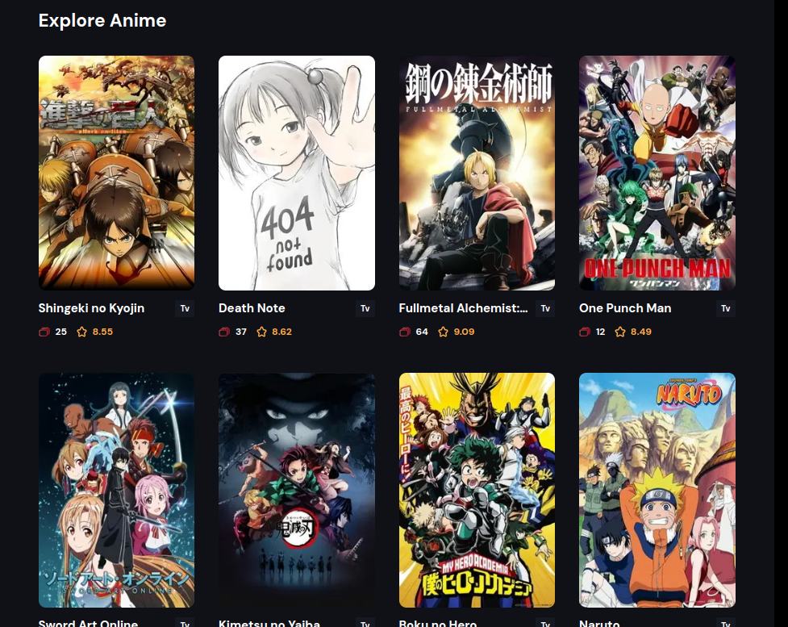

# Anime Hub



Anime Hub is a modern web application built with Next.js 14, utilizing Server Actions, Infinite Scroll, and Framer Motion animations. This application allows users to easily explore a variety of anime in an engaging way.

## Key Features

- **Server Actions**: Enables efficient data fetching.
- **Infinite Scroll**: Users can scroll to load more anime without needing to refresh the page.
- **Framer Motion Animations**: Adds smooth animations to enhance user experience.

## Installation

To run this project locally, follow these steps:

1. Clone this repository:

   ```bash
   git clone https://github.com/username/anime_hub.git
   ```

2. Navigate to the project directory:

   ```bash
   cd anime_hub
   ```

3. Install dependencies:

   ```bash
   npm install
   ```

4. Start the application:
   ```bash
   npm run dev
   ```

The application will run at `http://localhost:3000`.

## Technologies Used

- **Next.js 14**: A React framework for building web applications.
- **React**: A library for building user interfaces.
- **Framer Motion**: A library for animations.
- **Tailwind CSS**: A CSS framework for responsive design.

## Contributing

If you would like to contribute to this project, please fork this repository and submit a pull request.

## License

This project is licensed under the MIT License. See the [LICENSE](LICENSE) file for more details.
